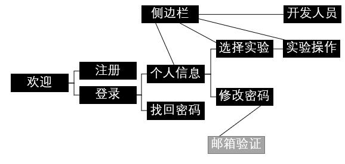

# 也许算是开发日志？（by wzr）
## 18-03-10
### 思路：
- 页面及功能具体安排：
	- 欢迎页面(a1)
		- 两个按钮：登录（进入登录页面）、注册（进入注册页面）
		- 背景图片1
	- 注册页面(b1)
		- 五个输入文本框：学号、姓名、密码、密码确认、邮箱（验证码/邮箱验证什么的以后再考虑）
		- 一个按钮：注册（显示注册成功文本框，自动登录进入个人信息页面）（如果有加邮箱验证之类的可以改成进入登录页面）
		- 背景图片1
	- 登录页面(b2)
		- 两个输入文本框：学号（/用户名/手机号/邮箱）、密码
		- 两个按钮：登录（进入个人信息页面）、忘记密码（进入找回密码页面）
		- 背景图片1
	- 找回密码页面(c1)
		- 一个显示文本框：注册用邮箱
		- 一个按钮：发送验证码（cd:60s，一个文本显示cd中以及剩余cd时长）
		- （然而暂时显示：开发中）
	- 个人信息页面(c2)
		- 一个显示文本框：学号，姓名
		- 两个按钮：修改密码（进入修改密码页面）、开始上课（进入选择实验页面）
	- 选择实验页面(d1)
		- 若干显示文本框/图文：实验信息即实验名称，老师姓名等
		- 若干按钮：选择各个实验（进入实验操作页面）
	- 修改密码页面(d2)
		- 三个输入文本框：原始密码（/邮箱验证码）、新密码、新密码确认
		- 一个按钮：修改密码（进入个人信息页面）
	- 实验操作页面(e1)
		- 若干输入文本框：输入各项实验参数
		- 若干图形框：显示示波器图像
		- 两个按钮：获取示波器图像（cd:5s，一个显示文本框显示剩余cd时间）、申请提交（内置cd5s，不显示）
	- 开发人员页面(f)
		- 若干显示文本框：开发人员信息（ID？学号姓名？）
		- 一个显示文本框：联系我们+邮箱（或者一个按钮？）
	- 侧边栏(g)
		- 显示学生姓名
		- 按钮：进入个人信息页面
		- 按钮：进入选择实验页面
		- 按钮：进入实验操作页面
		- 按钮：进入开发人员页面
		- 显示版本号
	- 页面关系图

	

### 完成工作：
- 建立各个页面文件和关系